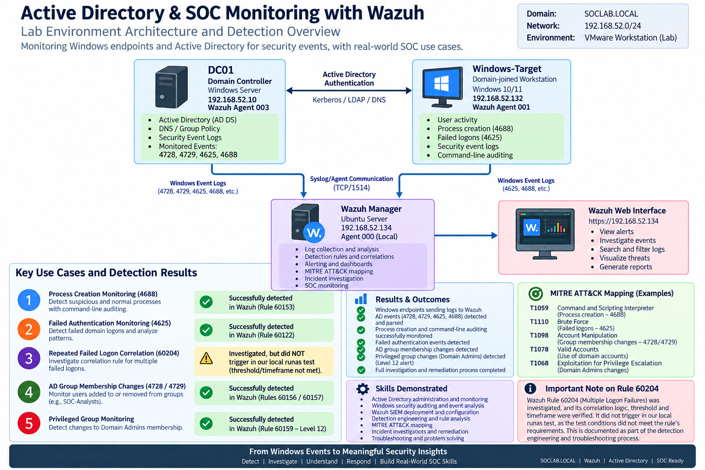
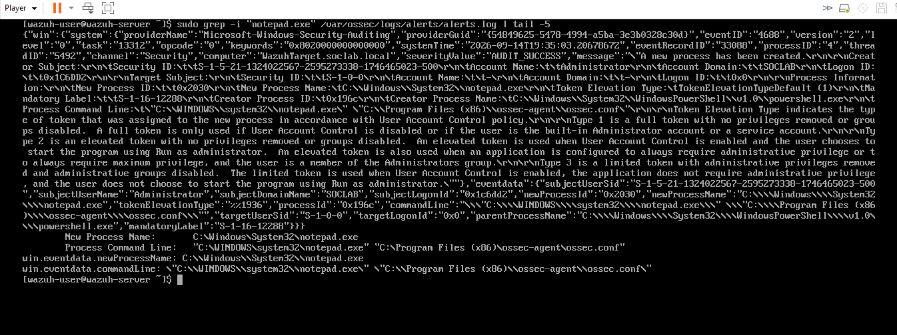
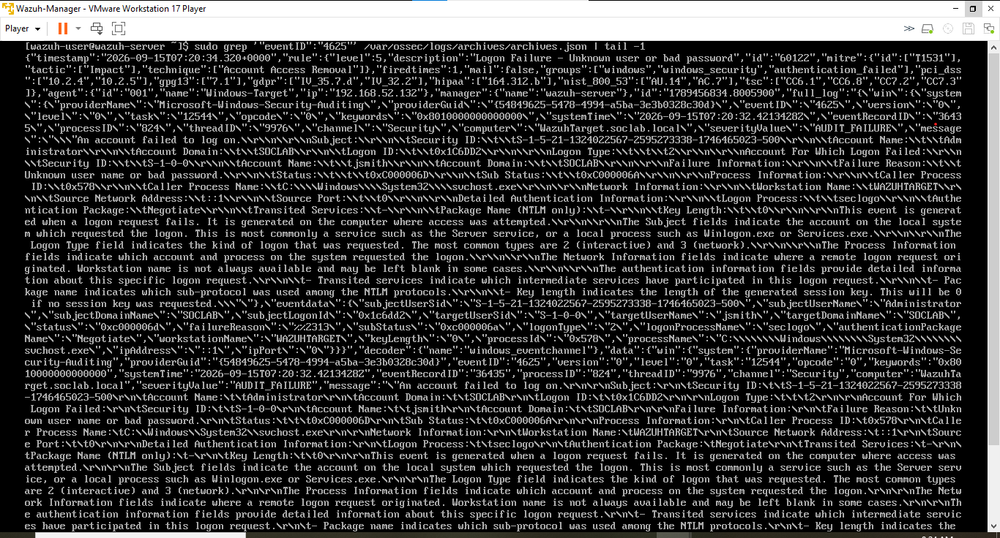
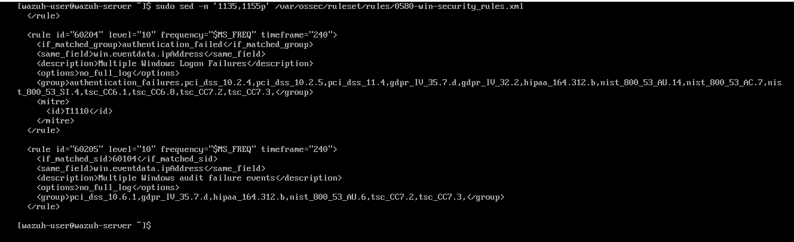
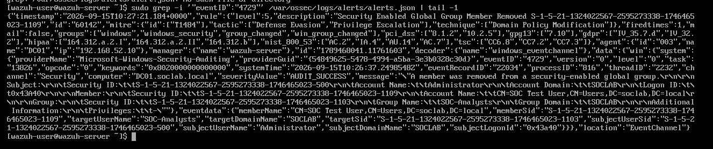
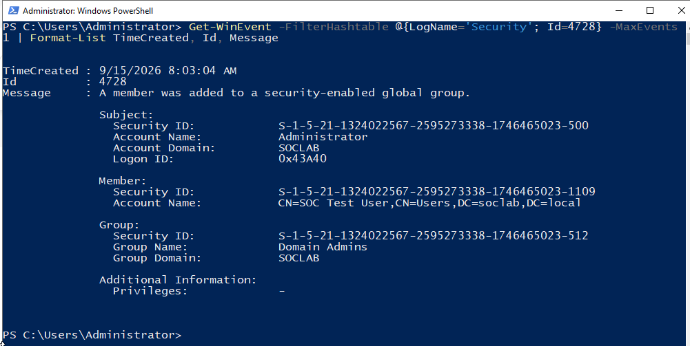
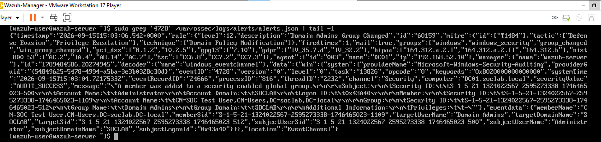

# Active Directory & Wazuh SOC Monitoring Lab

## Overview

This project documents the design and implementation of an Active Directory security monitoring lab integrated with Wazuh SIEM.

The goal was to simulate common Windows and identity-related security events, collect the resulting telemetry, investigate the events from a SOC analyst perspective, and validate how Wazuh prioritizes security activity.

The lab progressed from basic Active Directory and endpoint monitoring to detection of a controlled modification of the **Domain Admins** group.

### Key Result

A controlled privileged-group modification produced the following detection chain:

**SOC Test User added to Domain Admins → Windows Event ID 4728 → Wazuh Agent 003 → Wazuh Rule 60159 → Level 12 "Domain Admins Group Changed" alert → investigation → remediation**

---

## Lab Architecture

The environment was built in VMware on an isolated lab network.

| System | Role | IP Address | Wazuh Agent |
|---|---|---|---|
| DC01 | Active Directory Domain Controller | 192.168.52.10 | 003 |
| Windows-Target | Domain-joined Windows workstation | 192.168.52.132 | 001 |
| Wazuh Manager | SIEM / Security Monitoring | 192.168.52.134 | 000 (Local) |

**Domain:** `SOCLAB.LOCAL`

The Windows endpoint and domain controller forward security telemetry to the Wazuh Manager for centralized detection and investigation.

---

## Project Objectives

The project was designed to demonstrate practical SOC and Windows security monitoring skills, including:

- Active Directory deployment and administration
- Windows Security Event auditing
- Process creation monitoring
- Command-line auditing
- Authentication failure investigation
- Wazuh agent deployment and enrollment
- SIEM log ingestion and analysis
- Active Directory group-change monitoring
- Privileged-group modification detection
- Wazuh rule analysis
- Detection engineering and troubleshooting
- MITRE ATT&CK interpretation
- Incident remediation and validation

---

## Active Directory Environment

The lab used the `SOCLAB.LOCAL` Active Directory domain.

The domain controller was validated using PowerShell to confirm:

- Domain configuration
- Forest configuration
- Active Directory Domain Services
- DNS
- Active Directory Web Services

A SOC-focused structure was created with organizational units, users, and security groups to provide realistic identity-management activity for monitoring.

The Windows-Target workstation was then joined to `SOCLAB.LOCAL`.

---

## Detection Scenario 1 — Process Creation

Windows process creation auditing was enabled and validated using **Security Event ID 4688**.

A controlled process execution generated an event containing:

- Creator account
- New process name
- Parent process
- Process ID
- Token information
- Command-line arguments

Command-line auditing provided additional context that would help a SOC analyst distinguish normal execution from suspicious process activity.

The same event was located in Wazuh, validating the telemetry path:

**Windows endpoint → Wazuh Agent 001 → Wazuh Manager**

### Result

**Event 4688 process monitoring: Successful**

---

## Detection Scenario 2 — Failed Authentication

Controlled failed authentication attempts were generated against a domain account.

Windows recorded:

**Event ID 4625 — An account failed to log on**

The event contained useful investigation fields including:

- Target username
- Domain
- Logon type
- Failure reason
- Authentication package
- Workstation
- Source address

Wazuh successfully ingested the event and generated:

**Rule 60122 — Logon Failure: Unknown user or bad password**

### Result

**Individual failed-logon detection: Successful**

---

## Detection Engineering — Wazuh Rule 60204

During testing, multiple failed authentication events were generated to investigate Wazuh's higher-level correlation logic.

The relevant Wazuh rule was:

**Rule 60204 — Multiple Windows Logon Failures**

Inspection of the ruleset showed that Rule 60204 uses correlation conditions including a frequency threshold, timeframe, previous authentication-failure matches, and matching source fields.

However, the higher-level Rule 60204 alert **did not trigger during the local `runas` test**.

Rather than modifying the built-in rule simply to force an alert, the rule logic and test conditions were investigated.

### Result

**Individual Event 4625 detections: Successful**

**Rule 60204 correlation: Investigated, but not triggered under the test conditions**

### Lesson Learned

The presence of a SIEM correlation rule does not guarantee that every group of superficially similar events satisfies its correlation criteria.

Detection validation requires confirming the actual alert rather than assuming that repeated source events automatically triggered the higher-level rule.

---

## Detection Scenario 3 — Active Directory Group Changes

The Wazuh agent was deployed to DC01 so that domain-controller security events could be monitored directly.

Controlled group-membership changes were then performed.

### Member Added

Windows generated:

**Event ID 4728 — A member was added to a security-enabled global group**

### Member Removed

Windows generated:

**Event ID 4729 — A member was removed from a security-enabled global group**

The removal event was also identified in Wazuh, confirming successful DC01 telemetry ingestion.

### Result

**Active Directory group-change monitoring: Successful**

---

## Detection Scenario 4 — Domain Admins Modification

The highest-priority scenario simulated a privileged Active Directory group modification.

A disabled lab test account named `SOC Test User` was temporarily added to:

**Domain Admins**

Windows generated:

**Event ID 4728**

The event identified:

- Actor: `Administrator`
- Member: `SOC Test User`
- Target group: `Domain Admins`
- Domain: `SOCLAB`

Wazuh Agent 003 forwarded the domain-controller event to the Wazuh Manager.

Wazuh generated:

**Rule 60159 — Domain Admins Group Changed**

**Severity: Level 12**

This demonstrated that Wazuh assigned significantly higher priority to a privileged Domain Admins modification than to an ordinary group-membership change.

### Detection Chain

`Controlled privileged-group modification`

↓

`Windows Event ID 4728`

↓

`DC01 / Wazuh Agent 003`

↓

`Wazuh Manager`

↓

`Rule 60159`

↓

`Level 12 — Domain Admins Group Changed`

↓

`SOC investigation`

↓

`Remediation`

### Result

**Privileged Domain Admins modification detection: Successful**

---

## Remediation

After collecting the required evidence, the temporary test account was removed from the Domain Admins group.

The group membership was re-checked to confirm that the privileged group had returned to its original lab baseline.

The Wazuh environment was also validated before shutdown:

- Agent 000 — Wazuh Manager / Local
- Agent 001 — Windows-Target
- Agent 003 — DC01

All required agents were active.

---

## Troubleshooting and Lessons Learned

The project also involved significant troubleshooting, including:

- Wazuh resource constraints and service instability
- Agent-manager connectivity
- Wazuh agent enrollment
- Duplicate agent registration
- Windows Security Event validation
- SIEM ingestion verification
- Rule correlation analysis
- Differentiating source-event detection from higher-level correlation

One of the most important troubleshooting approaches used throughout the project was:

1. **Validate the event at the source**
2. **Validate agent connectivity**
3. **Validate SIEM ingestion**
4. **Inspect detection-rule logic**
5. **Confirm the actual alert before claiming successful detection**

This prevented endpoint, network, and SIEM issues from being treated as the same problem.

---

## Key Windows Events Investigated

| Event ID | Description |
|---|---|
| 4625 | Failed account logon |
| 4688 | New process created |
| 4728 | Member added to a security-enabled global group |
| 4729 | Member removed from a security-enabled global group |

---

## Key Wazuh Rules Investigated

| Rule | Description | Result |
|---|---|---|
| 60122 | Logon Failure — Unknown user or bad password | Detected |
| 60204 | Multiple Windows Logon Failures | Investigated — did not trigger in local test |
| 60159 | Domain Admins Group Changed | Detected — Level 12 |

---

## Evidence Highlights

### Process Creation Detection

### Failed Authentication

### Rule 60204 Investigation

### Active Directory Group Monitoring

### Privileged Domain Admins Modification

### Wazuh Level 12 Detection

---

## Skills Demonstrated

**Active Directory**
- Domain and forest administration
- Organizational units
- Users and security groups
- Domain membership
- Privileged-group monitoring

**Windows Security**
- Windows Security Event Logs
- Authentication auditing
- Process creation auditing
- Command-line auditing
- Identity-change auditing

**SIEM / Wazuh**
- Agent deployment and enrollment
- Endpoint and domain-controller monitoring
- Event ingestion
- Alert investigation
- Rule analysis
- Severity interpretation

**SOC Analysis**
- Event triage
- Authentication investigation
- Process investigation
- Privileged-access monitoring
- Evidence collection
- Detection validation
- Remediation verification

**Detection Engineering**
- Correlation-rule inspection
- Frequency/timeframe analysis
- Troubleshooting false assumptions
- Evidence-based detection validation

---

## Full Project Report

A detailed project report containing the implementation process, investigations, troubleshooting, remediation, and complete evidence set is available here:

[Active Directory & Wazuh SOC Lab Report](report/Active-Directory-Wazuh-SOC-Lab-Report.pdf)

---

## Disclaimer

This project was performed in an isolated cybersecurity lab environment for educational and portfolio purposes. All security events and privileged-group changes were intentionally generated against systems and accounts created specifically for the lab.
